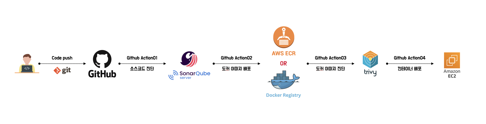

# Asset API Server

## ⚠️  **설명**
정보시스템 정보를 RESTful API로 제공하는 시스템

## 🛠️ CI/CD 파이프라인 구조


## 🗂️ 디렉토리 구조
```bash
├── app
│   ├── main.py
│   ├── api
│   │   ├── account.py
│   │   ├── asset.py
│   │   ├── deps.py
│   │   └── routers.py
│   ├── crud
│   │   ├── account.py
│   │   └── asset.py
│   ├── db
│   │   ├── base.py
│   │   └── session.py
│   ├── models
│   │   ├── account.py
│   │   └── asset.py
│   ├── schemas
│   │   ├── account.py
│   │   └── asset.py
│   └── templates
│       └── index.html
├── db
│   └── init.sql
├── image
│   └── pipeline.png
├── nginx
│   └── nginx.conf
├── vault
│   └── config
│       └── vault.hcl
├── docker-compose.yml
├── Dcokerfile
├── requirements.txt
└── README.md
```

## 📀 Data 구조
1. 자산(Asset) 테이블
```sql
CREATE TABLE IF NOT EXISTS asset (
    id          UUID PRIMARY KEY,
    status      INTEGER NOT NULL,
    type        TEXT NOT NULL,
    category    INTEGER NOT NULL,
    subcategory INTEGER NOT NULL,
    os          INTEGER NOT NULL,
    hostname    VARCHAR(255) NOT NULL,
    ip          INET NOT NULL
);
```

2. 분류(Category) 테이블
```sql
CREATE TABLE category (
    code        SERIAL PRIMARY KEY,
    name        TEXT NOT NULL,
);
```

3. 세분류(SubCategory) 테이블
```sql
CREATE TABLE subcategory (
    code        SERIAL PRIMARY KEY,
    name        TEXT NOT NULL,
);
```

4. 운영체제(Os) 테이블
```sql
CREATE TABLE os (
    code        SERIAL PRIMARY KEY,
    name        TEXT NOT NULL,
);
```

5. 계정(Account) 테이블
```sql
CREATE TABLE account (
    id 			UUID PRIMARY KEY DEFAULT gen_random_uuid(),
    username 	VARCHAR(255) NOT NULL,
    password 	TEXT NOT NULL,
    asset_id 	UUID NOT NULL,
    create_at 	TIMESTAMP WITH TIME ZONE DEFAULT NOW(),
    update_at 	TIMESTAMP WITH TIME ZONE DEFAULT NOW(),
    CONSTRAINT fk_asset FOREIGN KEY (asset_id) REFERENCES asset (id) ON DELETE CASCADE
);
```

## ⚙️ 실행
1. Repository clone 경로 이동
```bash
cd ~/dev/git
```
2. Repository clone
```bash
git clone https://github.com/llunchh/asset.git
```
3. Repository 경로 이동
```bash
cd asset
```
4. Docker compose 실행
```bash
docker-compose up -d
```
5. Docker Container 확인
```bash
docker ps

# asset_web, asset_db, nginx, vault 컨테이너 확인
```
## 🕸️ WEB 접속
1. Root 경로("/") 접속
```bash
https://asset.emro.co.kr/
```

2. docs, redocs 경로 접속
```bash
https://asset.emro.co.kr/docs
https://asset.emro.co.kr/redoc
```

3. API 경로("/api") 접속
```bash
https://asset.emro.co.kr/api
```

## ✅ 사용 예시
### 자산(Asset) 조회
1. 전체 자산(asset) 조회
```bash
https://asset.emro.co.kr/api/asset/all
```

2. 자산별 조회
- 서버(server) 조회
```bash
https://asset.emro.co.kr/api/servers
```
- 네트워크(network) 조회
```bash
https://asset.emro.co.kr/api/networks
```
- 보안장비(security) 조회
```bash
https://asset.emro.co.kr/api/securities
```
- 저장장치(storage) 조회
```bash
https://asset.emro.co.kr/api/storages
```
3. 복합 조회
- 상태별(status) 조회
```bash
# 활성화된 장비 조회
https://asset.emro.co.kr/api/asset/all?status=1
# 비활성화된 서버 조회
https://asset.emro.co.kr/api/servers?status=0
```
- 타입(type)별 조회
```bash
# 가상장비 조회
https://asset.emro.co.kr/api/asset/all?type=vm
# 물리장비 조회
https://asset.emro.co.kr/api/asset/all?type=pm
```
- 분류(category)별 조회
```bash
https://asset.emro.co.kr/api/asset/all?category=server
https://asset.emro.co.kr/api/asset/all?category=network
https://asset.emro.co.kr/api/asset/all?category=security
```
- 세분류(subcategory)별 조회
```bash
https://asset.emro.co.kr/api/asset/all?subcategory=firewall
https://asset.emro.co.kr/api/servers?subcategory=app_server
https://asset.emro.co.kr/api/networks?subcategory=l3_switch
```
- 복합 조회
```bash
https://asset.emro.co.kr/api/asset/all?status=1&type=vm&category=server&subcategory=app_server
```
4. 응답 예시
```json
[
    {
        "id":"560d9440-47bb-4de8-8138-0add9acf6160",
        "status":1,
        "type":"vm",
        "category":"server",
        "subcategory":"app_server",
        "hostname":"ad-test",
        "ip":"192.168.6.108",
        "os":"windows"
    },
    {
        "id":"08f07553-60b9-4a69-99e4-31ee7b97337d",
        "status":1,
        "type":"pm",
        "category":"server",
        "subcategory":"sec_server",
        "hostname":"nasca&escort",
        "ip":"192.168.5.108",
        "os_name":"windows"
    }
]
```
### 계정(Account) 조회
1. 패스워드 조회
```bash
https://asset.emro.co.kr/api/account/password?ip=192.168.5.55&username=root
```
2. 패스워드 조회 응답 예시
```json
[
    {
        "id":"5e541024-502f-46af-843d-97b989f1b210",
        "username":"root",
        "password":"8282op82@#",
        "asset_id":"574b766b-cb2b-4c57-9a5c-e80a20165138",
        "create_at":"2025-11-14T12:31:03.519647Z",
        "update_at":"2025-11-14T12:31:03.519647Z"
    }
]
```
3. 계정 조회
```bash
https://asset.emro.co.kr/api/account/usernames?ip=192.168.5.55
https://asset.emro.co.kr/api/account/usernames?hostname=dns
```
4. 계정 조회 응답 예시
```json
[
    "root",
    "iann",
    "test"
]
```
